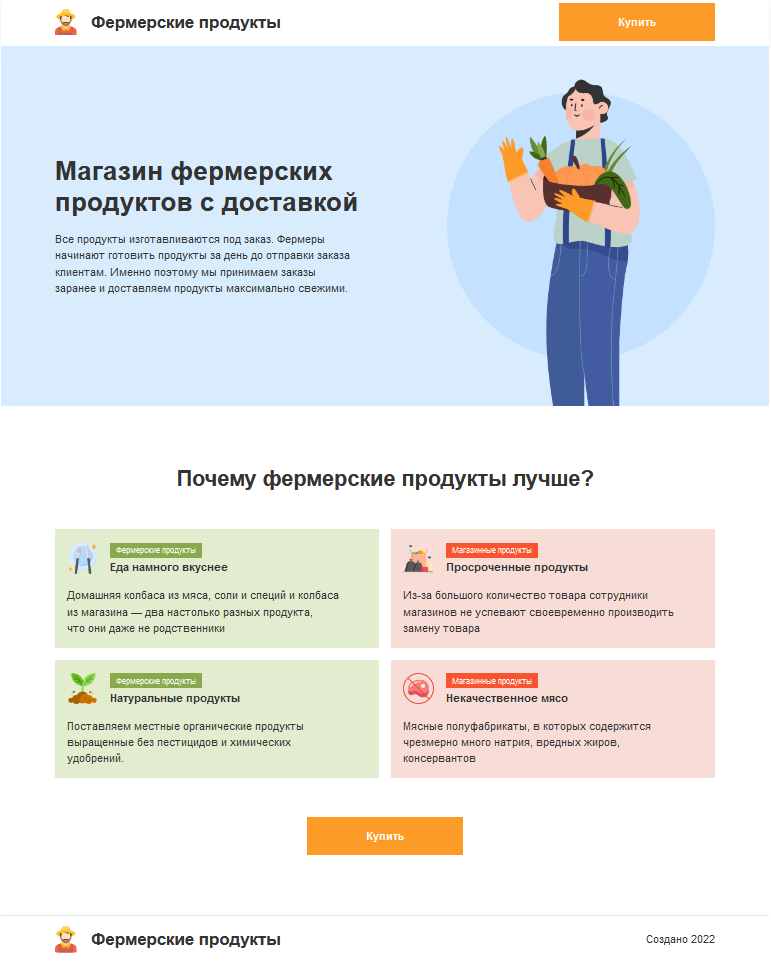
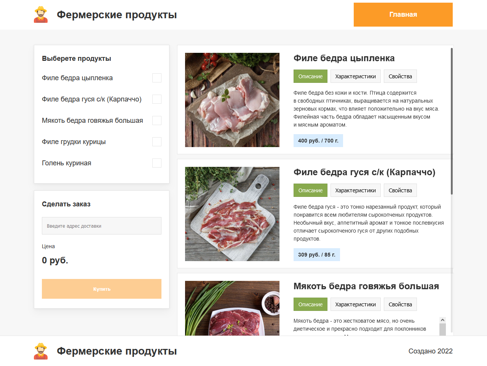

# Личный проект «Магазин: Фермерские продукты»

Репозиторий создан для обучения на профессиональном онлайн‑курсе «[Профессия «Фронтенд-разработчик»](https://htmlacademy.ru/profession/frontender)» от [HTML Academy](https://htmlacademy.ru).

* Студент: [Роман Ченцов](https://htmlacademy.ru/profile/id1192285)

## За время работы с проектом изучено:

* React (синтаксис jsx)
* Верстка простых React-компонентов
* Написание стилей для React-компонентов с помощью styled-component
* Интерактивность в React (управляемые формы, обработчики событий, хуки (useState, useEffect, useRef))
* Список продуктов реализован с помощью пакета Swiper
* Роутинг (react-router-dom)
* Сборка (Create React App)
* Storybook

## Запуск и сборка

* Установка зависимостей: `npm i`
* Сборка проекта: `npm run build`
* Запуск storybook: `npm run storybook`
* Запуск локального сервера: `npm start`

## Обзор проекта

https://dreamy-tartufo-f3bf6e.netlify.app/

### Главная страница

### Страница заказа

